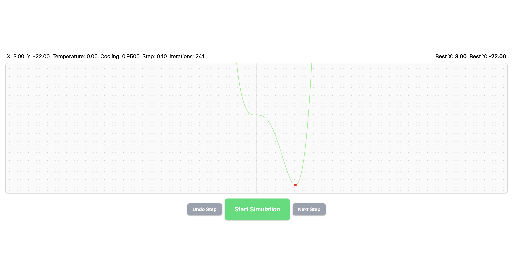

# Almarise Simulated Annealing

This project is a visualization tool for the Simulated Annealing optimization algorithm, built using Angular and Tailwind CSS. It allows users to see how the algorithm explores the solution space to find a global minimum.

## Screenshots

## TODO

- Cleanup the code.
- Improve responsiveness for mobile devices.